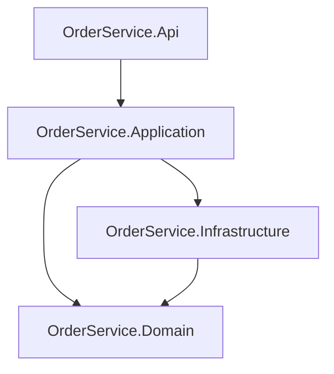

# Modern .NET 10 Backend Template (Order Service)


**Status:** v1.0 stable — production-ready scaffold for .NET 10 backends.

Production-ready backend scaffolding with .NET 10, Clean Architecture, DDD, CQRS (MediatR), Minimal APIs, JWT validation, EF Core, Redis cache, SAGA orchestration, Azure Service Bus integration points, observability, and CI/CD.

## Table of Contents

- [Architecture Overview](#architecture-overview)
- [Included Stack](#included-stack)
- [Solution Structure](#solution-structure)
- [Prerequisites](#prerequisites)
- [Clone and Install](#clone-and-install)
- [Quick Start](#quick-start)
- [EF Core Migrations](#ef-core-migrations)
- [API Endpoints](#api-endpoints)
- [API Examples](#api-examples)
- [JWT: Generate and Validate](#jwt-generate-and-validate)
- [Environment Configuration](#environment-configuration)
- [Docker](#docker)
- [Kubernetes](#kubernetes)
- [CI/CD](#cicd)
- [Test Coverage](#test-coverage)
- [Integration Tests (Containers)](#integration-tests-containers)
- [Azure Service Bus Emulator](#azure-service-bus-emulator)
- [Troubleshooting](#troubleshooting)
- [Related Projects](#related-projects)
- [Feedback](#feedback)
- [Contributing](#contributing)
- [Security](#security)
- [Code of Conduct](#code-of-conduct)
- [License](#license)
- [Changelog and Roadmap](#changelog-and-roadmap)
- [Best-Practice References Used](#best-practice-references-used)

## Architecture Overview

This solution follows **Clean Architecture** with **Domain-Driven Design (DDD)** and **CQRS** using MediatR. The dependency direction always points inward:



- **Domain**: entities, value objects, domain events, interfaces, and business rules. No dependencies on other projects.
- **Application**: command/query handlers, DTOs, validation, and orchestration. References Domain only.
- **Infrastructure**: EF Core, Redis, Service Bus publisher, and external dependencies. References Application and Domain.
- **Api**: Minimal API endpoints, OpenAPI/Swagger, authentication, health checks, and telemetry. References Application and Infrastructure.

The **SAGA orchestration** skeleton uses a retry policy to coordinate long-running business transactions (for example, submitting an order and publishing an `orders.submitted` event). Each step is a MediatR handler; compensation handlers can be added as the workflow grows.

## Included Stack

- .NET SDK 10 / C#
- Clean Architecture + DDD
- CQRS using MediatR
- Minimal APIs + OpenAPI/Swagger + XML docs
- JWT Bearer authentication and token validation
- EF Core (SQL Server)
- Redis Cache (cache-aside via MediatR behavior)
- Azure Service Bus publisher abstraction
- SAGA orchestration skeleton with retry policy
- Polly / resilience handlers
- Serilog logging
- OpenTelemetry metrics + Prometheus endpoint (Grafana-ready)
- Health checks (liveness/readiness/general)
- Docker + Kubernetes manifests
- xUnit + Moq + FluentAssertions tests
- Azure DevOps pipeline and GitHub Actions workflow

## Solution Structure

```text
OrderService.slnx
OrderService.Domain/
OrderService.Application/
OrderService.Infrastructure/
OrderService.Api/
OrderService.Tests/
.k8s/base/
.github/
AGENTS.md
NEW_PROJECT_PROMPT.md
azure-pipelines.yml
docker-compose.yml
```

## Prerequisites

- [.NET 10 SDK](https://dotnet.microsoft.com/download/dotnet/10.0)
- [Docker Desktop](https://www.docker.com/products/docker-desktop) or an equivalent Docker + Compose setup
- [Git](https://git-scm.com/)
- Optional: [kubectl](https://kubernetes.io/docs/tasks/tools/) for Kubernetes manifests
- Optional: [dotnet-ef](https://learn.microsoft.com/ef/core/cli/dotnet) global tool if you want to manage EF Core migrations explicitly

> This repo is a **scaffold/template**, not a packaged `dotnet new` template. Copy it to your own repository and adjust namespaces, project names, and infrastructure to your domain.

## Clone and Install

```bash
git clone https://github.com/markwinap/be_dotnet_template_saga.git
cd be_dotnet_template_saga
```

Restore dependencies:

```bash
dotnet restore OrderService.slnx
```

## Quick Start

1. Start infrastructure:

```bash
docker-compose up -d
```

This starts SQL Server, Redis, and Azure Service Bus Emulator for local development. The SQL container may take 30–60 seconds to become ready; if you see a SQL login error, wait and restart the API. See [Troubleshooting](#troubleshooting) for common issues.

2. Restore/build/test:

```bash
dotnet restore OrderService.slnx
dotnet build OrderService.slnx -c Release
dotnet test OrderService.slnx -c Release
```

3. Apply the database schema (optional for local dev):

The API runs `EnsureCreatedAsync` on startup, so the database is created automatically. For production, use [EF Core Migrations](#ef-core-migrations).

4. Run API:

```bash
dotnet run --project OrderService.Api
```

5. Open docs and metrics:

- Swagger UI: http://localhost:5101/swagger (dotnet run) or http://localhost:8080/swagger (docker compose)
- OpenAPI JSON: `/swagger/v1/swagger.json`
- Prometheus scrape endpoint: `/metrics`
- Health endpoints: `/health/live`, `/health/ready`, `/health`

## EF Core Migrations

The API uses `EnsureCreatedAsync` on startup to bootstrap the local SQL Server database automatically. For production or long-lived environments, create and run migrations with the `dotnet-ef` tool:

```bash
dotnet tool install --global dotnet-ef --version 10.0.*
dotnet ef migrations add InitialCreate --project OrderService.Infrastructure --startup-project OrderService.Api
dotnet ef database update --project OrderService.Infrastructure --startup-project OrderService.Api
```

The `OrderService.Infrastructure` project contains the `DbContext` and `Microsoft.EntityFrameworkCore.SqlServer` package. The `OrderService.Api` project is the startup project for design-time tooling.

## API Endpoints

- `POST /api/auth/dev-token` generates a development JWT token.
- `GET /api/orders` lists orders.
- `GET /api/orders/{id}` gets a single order.
- `POST /api/orders` creates an order.
- `POST /api/orders/{id}/submit` submits an order.
- `DELETE /api/orders/{id}` deletes an order.

## API Examples

### 1. Get a development token

```bash
curl -X POST http://localhost:5101/api/auth/dev-token \
  -H "Content-Type: application/json" \
  -d '{"userId": "dev-user"}'
```

Response:

```json
{
  "accessToken": "eyJhbGciOiJIUzI1NiIsInR5cCI6IkpXVCJ9..."
}
```

### 2. Create an order

```bash
curl -X POST http://localhost:5101/api/orders \
  -H "Content-Type: application/json" \
  -H "Authorization: Bearer <token>" \
  -d '{
    "customerId": "CUST-123",
    "shippingLine1": "123 Main St",
    "city": "Austin",
    "state": "TX",
    "postalCode": "78701",
    "country": "US",
    "items": [
      { "productCode": "SKU-1", "quantity": 2, "unitPrice": 10.00, "currency": "USD" }
    ]
  }'
```

Response:

```json
{
  "id": "00000000-0000-0000-0000-000000000000",
  "orderNumber": "ORD-123456",
  "customerId": "CUST-123",
  "status": "Created",
  "createdAtUtc": "2026-07-10T00:00:00Z",
  "total": 20.00,
  "items": [
    { "productCode": "SKU-1", "quantity": 2, "unitPrice": 10.00, "currency": "USD" }
  ]
}
```

### 3. List orders

```bash
curl -X GET http://localhost:5101/api/orders \
  -H "Authorization: Bearer <token>"
```

## Swagger Examples

Swagger/OpenAPI now includes request/response examples for the main order and auth endpoints to speed up local testing in Swagger UI.

## JWT: Generate and Validate

This template validates JWT tokens in the API using `AddJwtBearer` with strict token checks:

- issuer (`iss`)
- audience (`aud`)
- lifetime (`exp`)
- signature (`HS256` secret from config)

### Generate Token in JWT.io

1. Open https://jwt.io/
2. Choose algorithm `HS256`
3. Use header:

```json
{
  "alg": "HS256",
  "typ": "JWT"
}
```

4. Use payload (example):

```json
{
  "sub": "local-dev-user",
  "iss": "OrderService",
  "aud": "OrderServiceClients",
  "iat": 1731111111,
  "exp": 1731114711,
  "jti": "6ce6ea41-bf99-476b-b7e3-17747de42d74"
}
```

5. Use the same secret configured in `OrderService.Api/appsettings.json` under `Jwt:Secret`.
6. Call secured endpoints with:

```http
Authorization: Bearer <token>
```

Note: The API also exposes `/api/auth/dev-token` for local dev convenience. For production, use a standards-based IdP (OIDC/OAuth2) and asymmetric keys.

## Environment Configuration

`OrderService.Api/appsettings.json` and environment variables control the API. The `:` separator in `appsettings` becomes `__` in environment variables (for example, `Jwt:Secret` becomes `Jwt__Secret`).

| Setting | Description | Default | Required |
|---|---|---|---|
| `ConnectionStrings:DefaultConnection` | SQL Server connection string | `Server=localhost,1433;Database=OrderService;User Id=sa;Password=YourStrong@Passw0rd;TrustServerCertificate=True;` | Yes |
| `ConnectionStrings:Redis` | Redis endpoint for cache-aside | `localhost:6379` | Yes |
| `ConnectionStrings:ServiceBus` | Azure Service Bus connection string | `Endpoint=sb://localhost;SharedAccessKeyName=RootManageSharedAccessKey;SharedAccessKey=SAS_KEY_VALUE;UseDevelopmentEmulator=true;` | Yes |
| `Jwt:Issuer` | JWT issuer | `OrderService` | Yes |
| `Jwt:Audience` | JWT audience | `OrderServiceClients` | Yes |
| `Jwt:Secret` | HMAC256 secret, minimum 32 characters | `PLEASE-CHANGE-TO-AT-LEAST-32-CHARACTERS` | Yes |
| `Jwt:ExpiresMinutes` | Token lifetime in minutes | `60` | Yes |

For local Service Bus Emulator, use:
`Endpoint=sb://localhost;SharedAccessKeyName=RootManageSharedAccessKey;SharedAccessKey=SAS_KEY_VALUE;UseDevelopmentEmulator=true;`

When running in Docker Compose, the API uses the emulator container alias:
`Endpoint=sb://servicebus-emulator;SharedAccessKeyName=RootManageSharedAccessKey;SharedAccessKey=SAS_KEY_VALUE;UseDevelopmentEmulator=true;`

## Docker

Build and run the API image standalone. The container expects SQL Server, Redis, and Service Bus to be reachable, so the Compose stack is the recommended path.

Build:

```bash
docker build -f OrderService.Api/Dockerfile -t order-service:latest .
```

Run (with sample environment variables):

```bash
docker run -d --name order-service \
  -p 8080:8080 \
  -e ASPNETCORE_ENVIRONMENT=Development \
  -e ConnectionStrings__DefaultConnection="Server=host.docker.internal,1433;Database=OrderService;User Id=sa;Password=YourStrong@Passw0rd;TrustServerCertificate=True;" \
  -e ConnectionStrings__Redis="host.docker.internal:6379" \
  -e ConnectionStrings__ServiceBus="Endpoint=sb://host.docker.internal;SharedAccessKeyName=RootManageSharedAccessKey;SharedAccessKey=SAS_KEY_VALUE;UseDevelopmentEmulator=true;" \
  -e Jwt__Secret="PLEASE-CHANGE-TO-AT-LEAST-32-CHARACTERS" \
  order-service:latest
```

The Dockerfile uses a multi-stage build: `mcr.microsoft.com/dotnet/sdk:10.0` to publish, then `mcr.microsoft.com/dotnet/aspnet:10.0` for the runtime image.

## Kubernetes

Apply manifests:

```bash
kubectl apply -k .k8s/base/
```

## CI/CD

- Azure DevOps: `azure-pipelines.yml`
- GitHub Actions: `.github/workflows/ci.yml`

## Test Coverage

The test project uses `coverlet.collector`. Run tests with code coverage:

```bash
dotnet test OrderService.slnx --collect:"XPlat Code Coverage"
```

Coverage reports are written to `OrderService.Tests/TestResults/` as `coverage.cobertura.xml`. Open the report with [ReportGenerator](https://github.com/danielpalme/ReportGenerator) or any Cobertura-compatible viewer.

The CI workflow currently builds and runs the test suite; it does not enforce a coverage threshold yet. Add a threshold gate in `ci.yml` when the project matures.

## Integration Tests (Containers)

The test project includes container-backed integration tests for:

- EF Core + SQL Server path
- Redis cache path
- Azure Service Bus publisher path (Service Bus Emulator + SQL dependency)

Run all tests:

```bash
dotnet test OrderService.Tests/OrderService.Tests.csproj -c Release
```

To execute container integration tests fully, Docker Desktop must be running.

## Azure Service Bus Emulator

- Docker Compose includes `servicebus-emulator` using image `mcr.microsoft.com/azure-messaging/servicebus-emulator:latest`.
- Emulator entity config is stored at `docker/servicebus/config.json` and pre-creates:
  - Topic `orders.submitted` with subscription `orders.submitted.local`
  - Topic `integration-topic` with subscription `integration-subscription`
- Emulator ports:
  - `5672` for messaging traffic
  - `5300` for health/management endpoint
- Emulator health endpoint:
  - `http://localhost:5300/health`

## Troubleshooting

| Symptom | Likely Cause | Workaround |
|---|---|---|
| SQL login error on startup | SQL Server container is still initializing | Wait 30–60 seconds after `docker-compose up` or check `docker logs sqlserver` for `Recovery is complete`. |
| 401 Unauthorized on API calls | JWT is missing, expired, or signed with a mismatched secret | Generate a fresh token at `/api/auth/dev-token` or verify `Jwt:Secret` matches the issuer. |
| `docker-compose` port already in use | Another service uses `8080`, `1433`, `6379`, or `5300` | Stop conflicting services or override ports in `docker-compose.yml`. |
| Service Bus Emulator fails to start | Docker Desktop networking is not ready | Restart Docker Desktop, then run `docker-compose up -d` again. |
| Integration tests timeout | Testcontainers cannot reach Docker | Ensure Docker Desktop is running and the `host.docker.internal` alias is available. |

## Related Projects

- [CleanArchitecture](https://github.com/ardalis/CleanArchitecture) — a .NET 8+ Clean Architecture template with a strong sample domain and full-stack guidance.
- [eShopOnContainers](https://github.com/dotnet-architecture/eShopOnContainers) — a Microsoft reference application for microservices and DDD/CQRS patterns.

This template differs from the projects above by focusing on a minimal, SAGA-oriented backend scaffold with .NET 10, Azure Service Bus integration points, and a ready-to-run local emulator stack.

## Feedback

- Report bugs or request features: [GitHub Issues](https://github.com/markwinap/be_dotnet_template_saga/issues)
- Start a discussion: [GitHub Discussions](https://github.com/markwinap/be_dotnet_template_saga/discussions)

## Contributing

We welcome contributions. See [CONTRIBUTING.md](CONTRIBUTING.md) for the full guide. In short:

- Open an issue before large changes.
- Use feature branches and descriptive PR titles.
- Keep the Clean Architecture boundaries (Domain → Application → Infrastructure → Api).
- Add or update tests for new command/query handlers.
- Update the README, OpenAPI examples, and this changelog when contracts change.

## Security

If you discover a security vulnerability, please follow the instructions in [SECURITY.md](SECURITY.md). Do not open public issues for security-sensitive topics.

## Code of Conduct

This project follows the Contributor Covenant. See [CODE_OF_CONDUCT.md](CODE_OF_CONDUCT.md) for the full text.

## License

This project is released under the [MIT License](LICENSE).

## Changelog and Roadmap

See [CHANGELOG.md](CHANGELOG.md) for release notes. Upcoming roadmap items:

| Milestone | Target | Description |
|---|---|---|
| v1.1 | 2026 Q3 | Add integration tests for the SAGA compensation path and Terraform for Azure provisioning. |
| v1.2 | 2026 Q4 | Add OpenTelemetry tracing exporters and example Grafana dashboards. |

## Best-Practice References Used

- JWT bearer validation in ASP.NET Core:
  https://learn.microsoft.com/en-us/aspnet/core/security/authentication/configure-jwt-bearer-authentication?view=aspnetcore-10.0
- Minimal APIs in ASP.NET Core:
  https://learn.microsoft.com/en-us/aspnet/core/fundamentals/minimal-apis?view=aspnetcore-10.0
- .NET HTTP resilience patterns:
  https://learn.microsoft.com/en-us/dotnet/core/resilience/http-resilience?view=net-10.0
- ASP.NET Core metrics with OpenTelemetry/Prometheus/Grafana:
  https://learn.microsoft.com/en-us/aspnet/core/log-mon/metrics/metrics?view=aspnetcore-10.0
- JWT debugger/token generation:
  https://jwt.io/